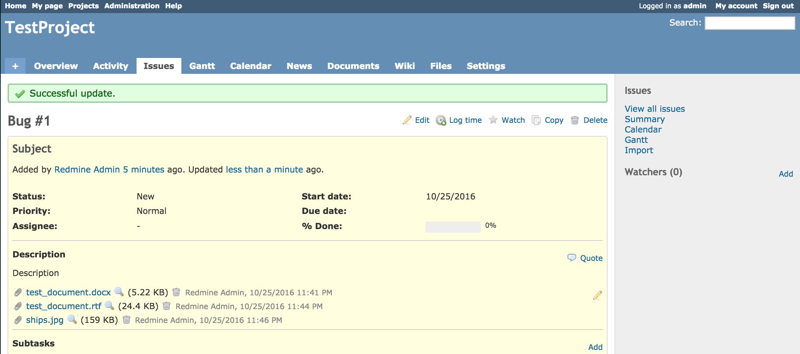
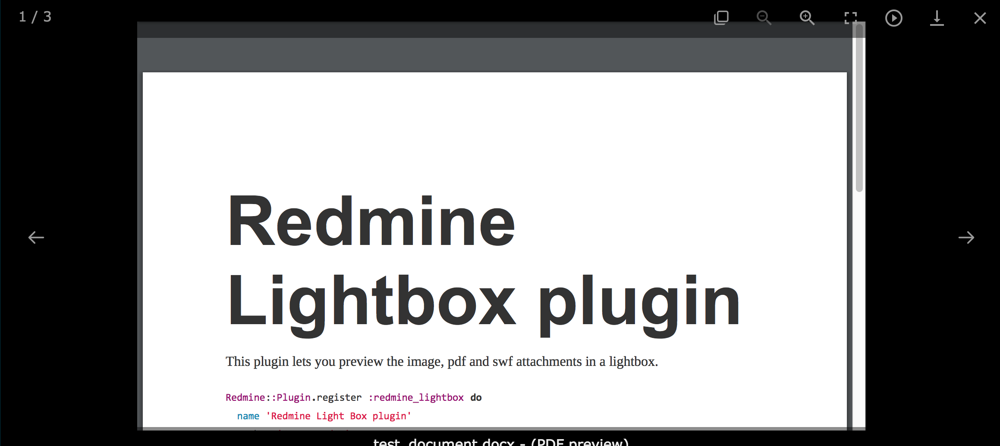
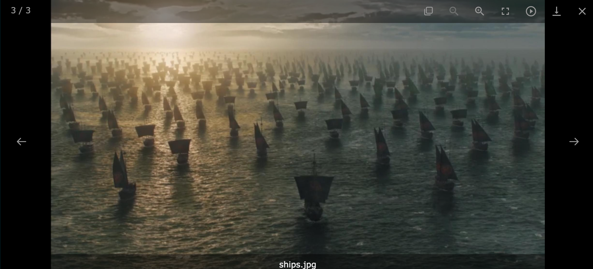
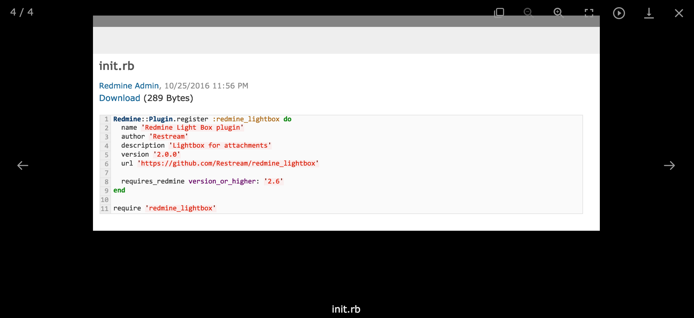

# Redmine Lightbox Plugin

This plugin enables you to preview the files attached to issues in Redmine. The plugin currently supports various image (.png, .jpg, .gif, .swf, etc.) and document (,pdf, .docx, .doc, .rtf) formats.

## Compatibility

This plugin version is compatible only with Redmine 3.x and later.

## Installation

1. To install the plugin
    * Download the .ZIP archive, extract files and copy the plugin directory into #{REDMINE_ROOT}/plugins.
    
    Or

    * Change you current directory to your Redmine root directory:  

            cd {REDMINE_ROOT}
            
      Copy the plugin from GitHub using the following commands:
      
            git clone https://github.com/Restream/redmine_lightbox.git plugins/redmine_lightbox
            
2. Install the required dependencies 

   On Debian Linux:

        sudo apt-get install libreoffice-common unoconv
  
   On MacOS: 
        
        brew install unoconv --HEAD
        
   Note: In order to use unoconv on MacOS, a copy of LibreOffice between versions 3.6.0.1 - 4.3.x must be installed.

3. Install the required gems using the command:  

        bundle install  
      
4. These plugins require a migration. Run the following command to upgrade your database (make a database backup before):  

        bundle exec rake redmine:plugins:migrate RAILS_ENV=production
            
5. Restart Redmine.

## Usage

The plugins adds an 🔎  icon next to issue attachments that can be previewed.  

Clicking the icon opens a pop-up window where you can preview the attachment. If there are several files attached to the issue, you can proceed to the next attachment by clicking the arrow button.

You can view ordinary images:

Text files also can be previewed:

## Author

This repo is fork from https://github.com/zipme/redmine_lightbox. And author of original repo is https://github.com/zipme 

## Maintainers

Danil Tashkinov, [github.com/nodecarter](https://github.com/nodecarter)

## License

This plugin is published under the MIT license.